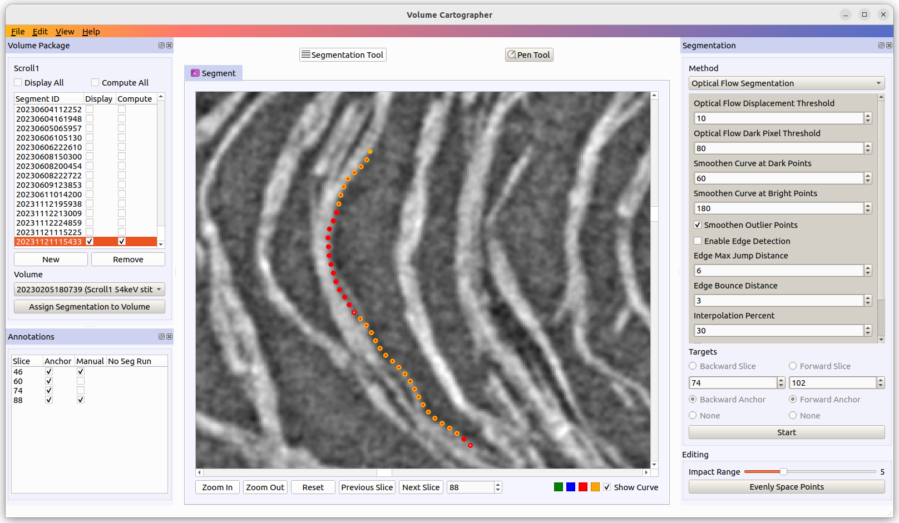
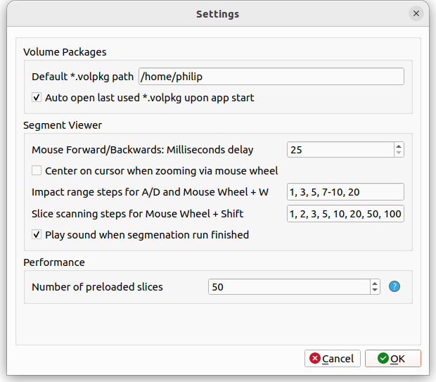

**Volume Cartographer** is a toolkit and set of cross-platform C++ libraries for
virtually unwrapping volumetric datasets. It was designed to recover text from
CT scans of ancient, badly damaged manuscripts, but can be applied in many
volumetric analysis applications.

## Changes 2024
- Merged in latest version from Educelab (state 2024-05-08)
- Added memory-mapped (`mmap`) TIFF loading which improves loading speed and therefore results in smoother slice scanning plus drastically reduces RAM usage
- Added "Y"/"Z"/"V" shortcut to evenly space points on current curve (in Segmentation tool)
- Added slice view rotation via "Hold S + Mouse Wheel" and "X"/"I" to reset rotation
- Added incremental slice rotation via "U" and "O"
- Added spin box to see current rotation state and manually adjust
- Fixed Docker builds to no longer require "export QT_PLUGIN_PATH" in order to find xcb platform library
- Added user setting to override the default slice view scroll speed
- Added dark theme support
- Adjusted slice scanning step sizes on number keys (from 1/2/5/10/100 to 1/5/10/50/100)
- Fixed bug with incorrect slice view zoom factoring
- Performance improvements for slice rendering and scanning by preventing internal recreation of graphics scene items plus skipping QPixmap image data conversions

## Changes 2023
This fork contains the following changes compared to upstream currently:

### Changes from Whist List / Feature Requests of Segmentation Team
- Implemented both points from #1 (*"Scan in Segment Mode"*) of the segmentation wish list ([Goole Doc](https://docs.google.com/document/d/1YFILhWVHyijU_Yky3lKPvGAjmYm2QnRTYzMM7VqcogA)):
  * Added new keyboard shortcuts so that now via number keys slice navigation in 1, 2, 5, 10 and 100 steps is available
  * Added option to scan through slices while in the Segmentation Tool without losing any made curve changes (when user leaves the Segmentation Tool, a warning is shown to offer to either discard the curve changes, store them or cancel)

- Implemented topics #2 (*"Anchor manually annotated lines"*) and #6 (*"Pull metadata for training autosegmenters"*) of the segmentation wish list ([Goole Doc](https://docs.google.com/document/d/1YFILhWVHyijU_Yky3lKPvGAjmYm2QnRTYzMM7VqcogA)):
  * Implemented new `*.vcano` annotation file. It consists of 4 `double` values per point, storing the following information:
    * Slice number the annotation point belongs to
    * Bit flags to annotate each point (there is space for a lot more flags to extend further):
        * “is anchor”
        * “was manually changed”
        * “was used in segmentation run” (to highlight that the slice curve was changed, but not yet used in any segmentation run)
    * Original X and Y coordinates of the point as output by segmentation algorithm
  * A new annotation file will automatically be added when none exists and it will get added to the `meta.json` information
  * Added new annotation list into UI to see the annotations and manually change the anchor state of a slice (shortcut "L" when in Segmentation Tool); double-click on an annotation entry jumps to the corresponding slice
  * Manually changed curve points are now highlighted (new color selector was added so users can customize the color; defaults to orange) while still showing the original curve color in the middle of the point
  * Reworked segmentation algorithm trigger section that allows independent forward and backward segmentations with one "Start" click. For each direction users can either:
    * Set an explicit end slice number (this number will automatically be adjusted internally in case it would go beyond any existing anchor in that direction to protect them against overwrites)
    * Set anchor mode, in which case the end slice will automatically be the next anchor in that direction (if there is none, no segmentation will happen)
    * Set to none, if one of the directions should not be used
  * The "Interpolation Length" and "Interpolation Window" parameters of OFS were replaced by an "Interpolation Percentage" which will automatically be converted into the appropriate number of slices when using "Anchor mode" for segmentation

### UI / UX Improvements
- Implemented image dragging/panning via right mouse button
- Implemented Undo/Redo for curve drawing changes
- Adjusted mouse wheel usage:
  * Mouse Wheel + Ctrl = Zoom in/out (as in most image apps); was previously Mouse Wheel + Shift in VC
  * Mouse Wheel + Shift = Next/previous slice (scan range can be set via Q/E keys with visual feedback)
  * Mouse Wheel + W Key Hold = Adjust impact range (shows visual feedback next to the cursor)
  * Mouse Wheel + R Key Hold = Follow Highlighted Curve (same as Mouse Forward/Backward buttons)
- Added Ctrl + G to easily jump to a given slice (opens an input popup to type in the slice index) => no more need to manually click into the spinner below the viewer
- Changed curve changes / point snapping to only use the left mouse button (without any additional modifiers)
- Switched to using proper dock widgets for the path list, annotation list and algorithm parameters (which previously was fixed below the path list in one UI element). This allows the user to freely position them and even make them float so they can be moved outside the VC e.g. to a second monitor. A "View" menu was added to hide/show the individual docks.
- Themed the UI to be visually clearer/structured and more visually pleasing (a bit of eye candy rarely hurts...)
- Added shortcut "F" to jump back to the slice the Segmentation Tool was started on
- Added a "Recent volpkg" list and menu option to easily reopen one of the last 10 volume packages
- Added the feature to remove a path from the `volpkg`
- Use spin boxes for slice numbers (they allow proper min/max value handling and mouse wheel can be used to change the numeric value)
- Added button to "Evenly Space Points" on the active "Compute" curves in Segmentation Tool mode (handy when during manual curve changes points get too bunched up to work with)
- Added volume name into volume dropdown
- Ensured that columns in segment table auto adjust their width (so that segment ID is fully visible)
- Highlight the toggle button of the currently active tool mode
- Added a scroll area for the segmentation algorithm parameters, since on smaller screen sizes, there often was not enough vertical space and all the labels/inputs got visually squished together.
- Added tooltips to the color selectors boxes below the segment viewer
- Added app logo for Linux

#### User Settings Dialog
- Added settings dialog (using an INI file `VC.ini`) to make some features configurable by the user
- Added user defined default path to look for `volpkg` when in "Open volpkg" dialog
- Added user setting to auto open the last `volpkg` upon app start
- Added user setting to configure how many slices should automatically be preloaded once Segmentation Tool is entered (previously was hardcoded to 100 slices which depending on the slice image size, might be too much for the machine running the application)
- Added user setting to configure the initial step size to be used in segmentation runs (if the algorithm supports it), plus sets the initial slice scan range to the same value and uses the step size from the algorithm to control the behavior of the slice preloading when entering Segmentation Tool
- Added user setting to configure the impact range values the application should use (still defaults to 1 to 20). User can specify a mixture of explicit numbers and ranges for example "1, 2, 3, 5, 7-10"
- Added user setting to configure the scan range values the application should use (when Mouse Wheel + Shift scanning). User can specify a mixture of explicit numbers and ranges for example "1-5, 10, 20, 30, 100"
- Added user setting to configure the delay in milliseconds between point jumps in the Mouse Forward/Backward button mode
- Added user setting to center image slice on mouse cursor during mouse wheel zooming (configurable via settings)

### Bug Fixes
- Fixed a bug in the OFS segmentation implementation that would (during the interpolation part), output invalid `vcps` point sets, as the first two segment rows both used the same slice number / Z-value (e.g. 0 when it should have been 0 for the first and 1 for the second slice/row)
- Ensure app ends slice preloading threads and exits properly
- Correctly clear the "Display All" and "Compute All" checkboxes when closing a volume, so they are in the correct initial state when a new volume gets opened
- Fixed some crashes I came across